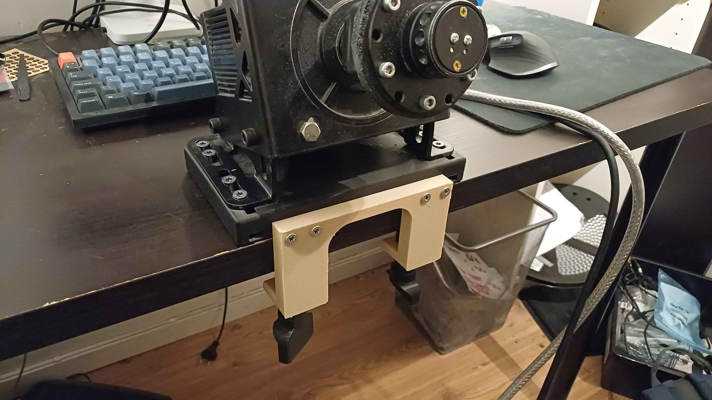

# Sim racing table clamp

<!-- Project description -->
Mechanical part to fasten a 130ST-M10015 to table.

## images
### 3D design render

### Physical image

## Mechanical hardware
- 8 M3x10mm
- 8 M3 nuts
- 4 M3x10mm countersunk