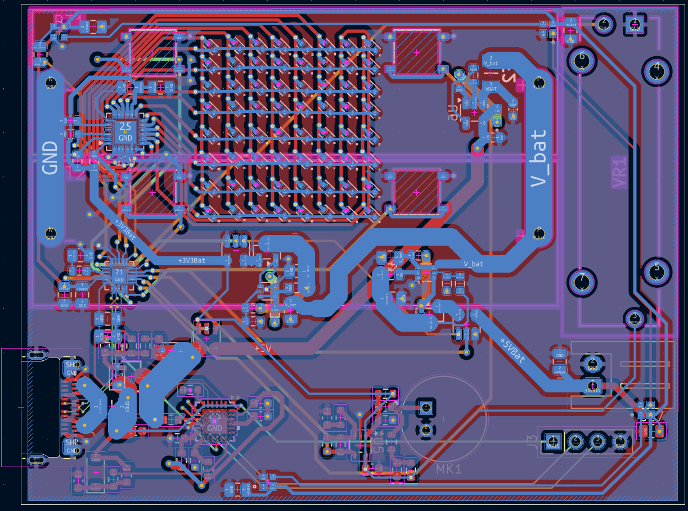
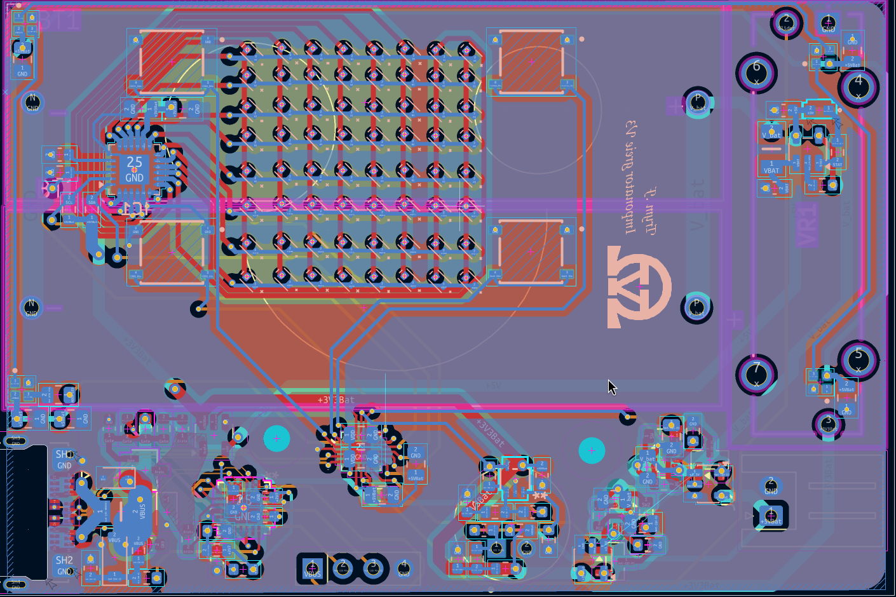

# OV-imponator power circuit

<!-- Project description -->
A small circuit able to charge two AA Li-Ion and Li-Po batteries with USB PD and deliver 5V power to an external device. From the previous designed I have added a LED matrix, 4 buttons, 1 microphone, 4 addresable LEDs and a sliding POT.meter connected to a Silicon Labs microcontroller.

I routed a 4 layer and a 6 layer PCB for this design, because the price for a 6 layer design was cheaper when I checked the price of ordering a 4 layer pcb with vias in pads.

## images
### PCB design
#### 4 layer PCB

#### 6 layer PCB

## Physical image

