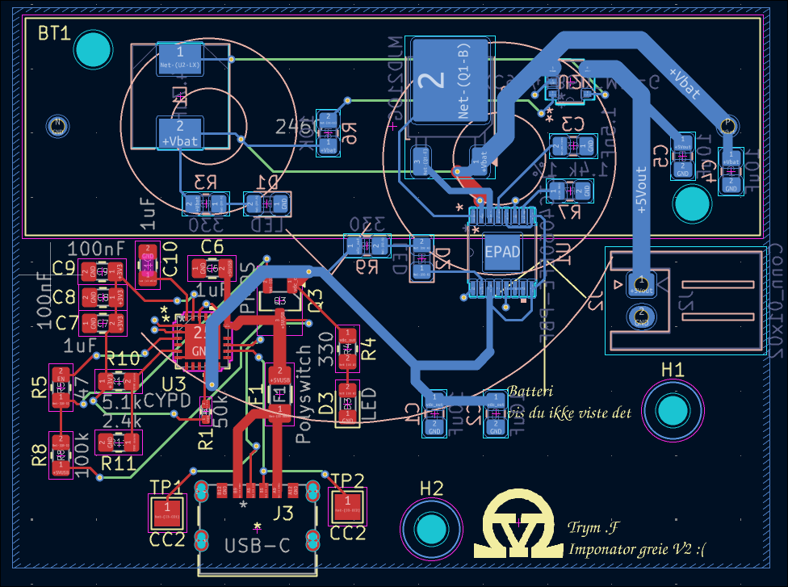
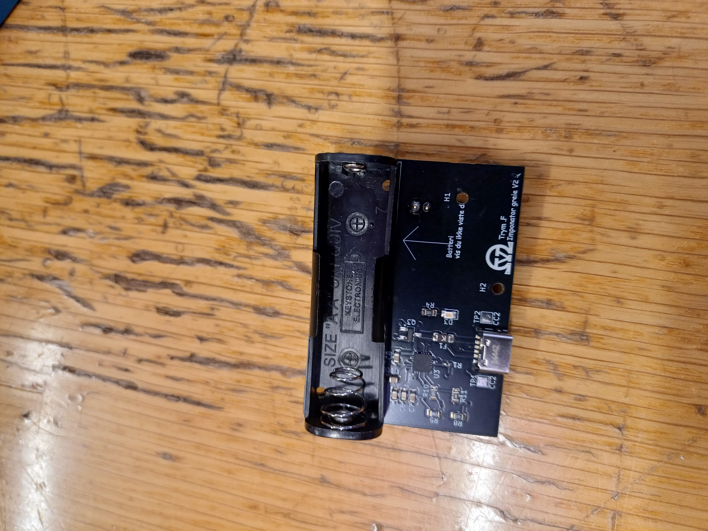

# OV-imponator power circui

<!-- Project description -->
A small circuit able to charge a AA NimH battery with USB PD and deliver 5V power to an external device. I was really dissatisfied with the cost and feature set. I will probably make a new design with more budget friendly components and more customizable features.

N.B. Some of the LEDs are misplaced in the design, and will not light up. 

## images
### PCB design

## Physical image

